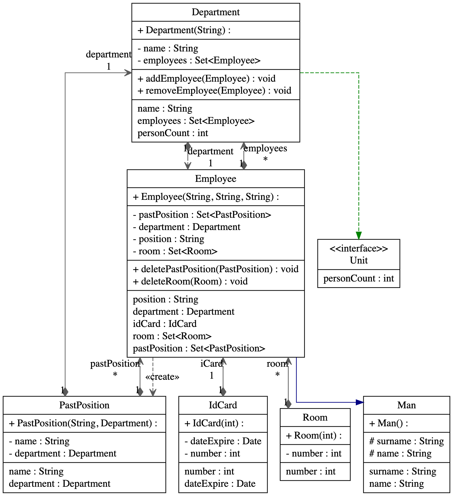

### Реализовать структуру классов
Вам дана схема класса (UML-диаграмма, с подсказками) и текстовое пояснение к архитектуре. 

**Ваша задача**: 
полностью реализовать структуру, сохраняя наследования, вложенность и абстрактность. Также нужно заметить, что некоторые сущности должны быть интерфейсами, а некоторые - абстрактными классами. Логику в методах реализовывать не нужно, достаточно сделать компилируемые методы.

